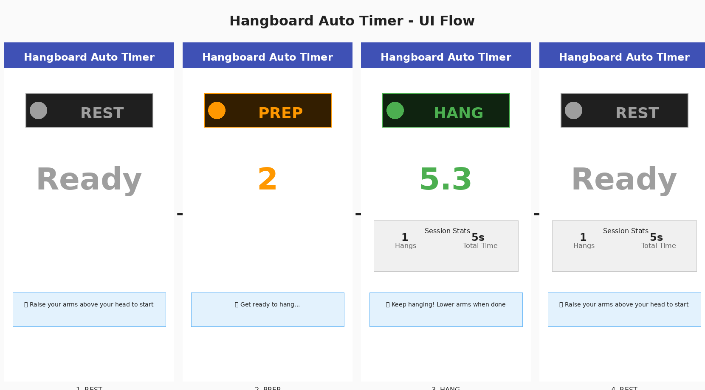
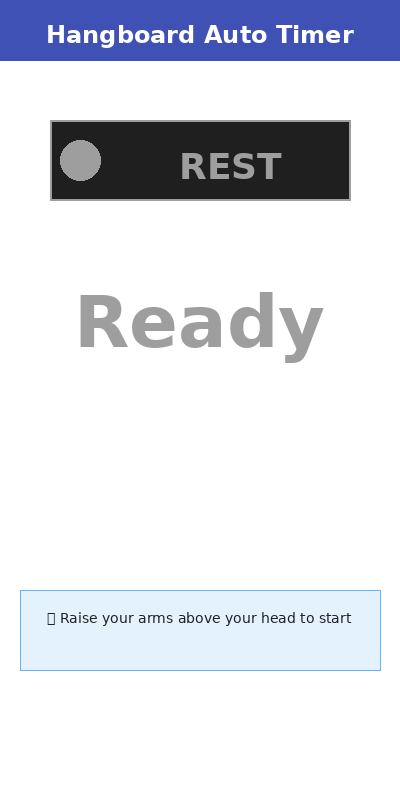
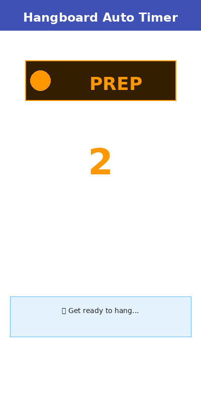
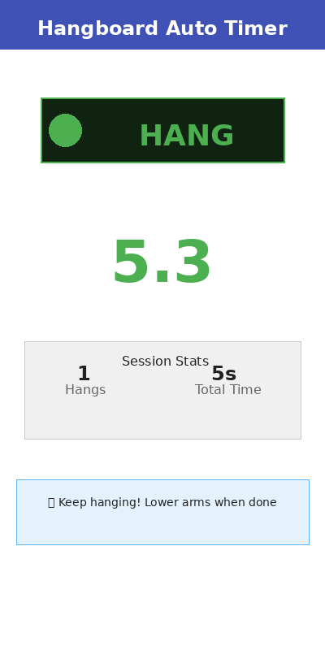
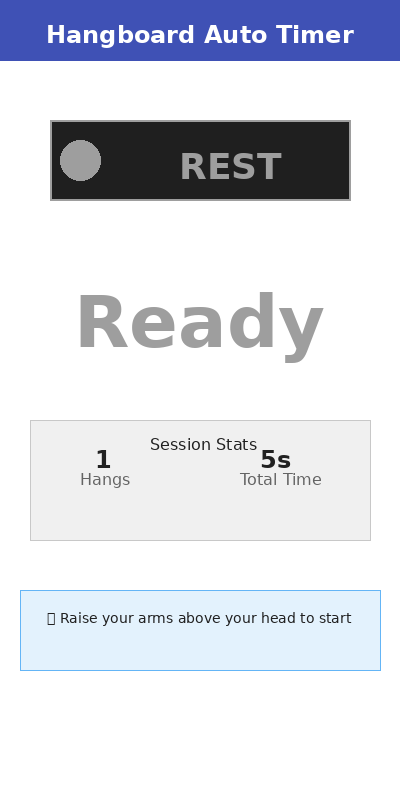

# Hangboard Auto Timer - UI Flow Documentation

This document demonstrates the user interface flow for the Hangboard Auto Timer app.

## Complete UI Flow



The app cycles through 4 main states, driven by the user's arm positions detected via pose estimation (currently using fake events for testing).

---

## State 1: REST (Initial State)



**Characteristics:**
- **Color**: Grey
- **Timer Display**: "Ready"
- **Session Stats**: No active session yet (0 hangs, 0s total)
- **Instruction**: "👆 Raise your arms above your head to start"

**Behavior:**
- App is waiting for user to begin
- User raises arms above head
- After holding arms up for 400ms, transitions to PREP state

---

## State 2: PREP (Preparation)



**Characteristics:**
- **Color**: Orange
- **Timer Display**: Countdown (2, 1...)
- **Session Stats**: No hangs completed yet
- **Instruction**: "⏱️ Get ready to hang..."

**Behavior:**
- 2-second countdown timer
- User prepares to grip the hangboard
- When countdown reaches 0, automatically transitions to HANG state

---

## State 3: HANG (Active Workout)



**Characteristics:**
- **Color**: Green
- **Timer Display**: Elapsed time with decimal (e.g., "5.3" seconds)
- **Session Stats**: Shows current session data
  - Hangs: 1
  - Total Time: 5s
- **Instruction**: "💪 Keep hanging! Lower arms when done"

**Behavior:**
- Main workout timer actively counting
- User is hanging on the hangboard
- First 800ms is a "grace period" - arm movements ignored to prevent false stops
- After grace period, if user lowers arms for 400ms, transitions to REST state
- Hang duration is recorded in session stats

---

## State 4: REST (After Hang)



**Characteristics:**
- **Color**: Grey (back to rest)
- **Timer Display**: "Ready"
- **Session Stats**: Shows completed session data
  - Hangs: 1 (persisted from previous hang)
  - Total Time: 5s (cumulative)
- **Instruction**: "👆 Raise your arms above your head to start"

**Behavior:**
- Hang is saved to session store
- User can rest before starting another hang
- Session stats persist and accumulate with each hang
- Raising arms again starts the cycle over (PREP → HANG → REST)

---

## State Transitions

```
REST → PREP → HANG → REST
 ↑                     |
 └─────────────────────┘
```

### Transition Conditions

| From  | To    | Trigger                              | Duration |
|-------|-------|--------------------------------------|----------|
| REST  | PREP  | Arms raised above head               | 400ms    |
| PREP  | HANG  | Countdown timer completes            | 2000ms   |
| HANG  | REST  | Arms lowered (after grace period)    | 400ms    |

### Grace Period

When entering HANG state, the first **800ms** is a grace period:
- Arm-down signals are ignored
- Prevents false stops from user adjusting grip
- Ensures intentional hang completion

---

## Configuration Parameters

All timing values are configurable via `HangConfig`:

| Parameter      | Default | Description                                    |
|----------------|---------|------------------------------------------------|
| upHoldMs       | 400ms   | Time to hold arms up before triggering PREP   |
| downHoldMs     | 400ms   | Time to hold arms down before ending HANG     |
| prepMs         | 2000ms  | Preparation countdown duration                 |
| stopIgnoreMs   | 800ms   | Grace period to ignore false stops            |
| confMin        | 0.5     | Minimum confidence for pose detection         |

---

## Session Tracking

The app tracks training sessions with:

- **Hang Count**: Total number of completed hangs
- **Total Time**: Cumulative duration of all hangs
- **Individual Records**: Each hang stored with start time and duration

Session data persists across state transitions and can be saved/loaded via the `SessionStore` interface.

---

## Testing with Fake Events

Currently, the app uses `FakePoseService` which:
- Generates automatic arm position events
- Alternates between "arms down" and "arms up" every 2 seconds
- Allows full state machine testing without ML integration
- Confidence always set to 0.95 (well above threshold)

This enables development and testing of the complete UI flow before ML model integration.

---

## Color Scheme

| State | Color  | Hex     | Usage                    |
|-------|--------|---------|--------------------------|
| REST  | Grey   | #9E9E9E | Idle/waiting state       |
| PREP  | Orange | #FF9800 | Preparation/warning      |
| HANG  | Green  | #4CAF50 | Active workout           |

The color scheme provides clear visual feedback about the current state at a glance.
